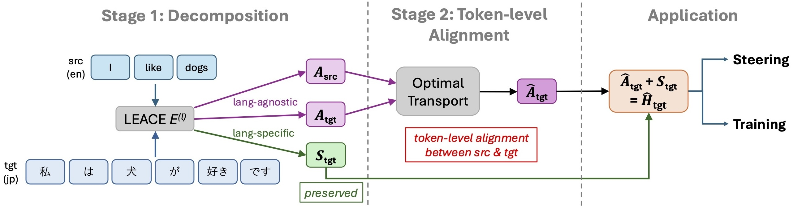

# Cross-Lingual Representation Alignment in a Language-Agnostic Space via Optimal Transport 
(Paper to appear at EMNLP 2026 main conference)



This repository provides codes for the paper "Cross-Lingual Representation Alignment in a Language-Agnostic Space via Optimal Transport".

We introduce **CAROT** (Cross-Lingual Alignment of Representations in a Language-Agnostic Space via Optimal Transport), which aligns token-level representations of parallel sentences while retaining the target language's language-specific component.

## Installation

This repository uses [uv](https://docs.astral.sh/uv/) for dependency and lock-file
management. Install the reusable package and development tools with:

```bash
uv sync
```

Install the paper-reproduction dependencies as well:

```bash
uv sync --extra experiments
```

Run commands through `uv run`.
not required. To update the lock file after changing dependencies, use `uv lock`.

## Public API

CAROT computes an aligned target-language representation with the source-language representation of a parallel sentence pair.

```python
from carot import CAROT, LayerArtifacts, OTConfig

# Load the LEACE eraser and whitening transform for the target layer.
# The script to calculate these artifacts is provided (see "Reproducing the CAROT experiments" below).
artifacts = LayerArtifacts.load("artifacts/llama/layer_12.pt")
method = CAROT(
    artifacts,
    OTConfig(perplexity_threshold=0.25),
).to(target_hidden.device)

aligned_target = method(
    source_hidden,  # (source_tokens, hidden)
    target_hidden,  # (target_tokens, hidden)
)
```

For training, the same calibrated transform defines the target:

```python
from carot import carot_alignment_loss

loss = carot_alignment_loss(
    source_hidden,
    target_hidden,
    method.eraser,
    method.whitening,
    method.config,
)
```

The source branch and generated alignment target are detached; gradients flow
through the current target-language representation.

## Repository layout

```text
CAROT/
├── src/carot/              # reusable method, fitting, artifacts, and loss
├── tests/                  # fast tests of mathematical invariants
├── experiments/
│   ├── preprocessing/      # calibration artifact production
│   ├── steering/           # model hooks and inference-time evaluation
│   ├── training/           # alternating SFT/CAROT training
│   ├── evaluation/         # GMMLU, KLAR, Belebele, XQuAD evaluation
│   └── configs/            # paper-selected parameters and future run configs
└── docs/                   # architecture and migration audit
```

See `docs/architecture.md` for ownership boundaries and the end-to-end flow.

## Experiments

Running `uv sync --extra experiments` installs the experiment code as `carot.experiments` and creates four command-line entry points.

### 1. Fit LEACE and semantic covariance

Place NTREX-128 at `NTREX/NTREX-128/`.
WMT24++ is loaded from Hugging Face.

Then extract sentence representations, fit LEACE and calculate/save the covariance eigensystem with:

```bash
uv run carot-preprocess \
  --config experiments/configs/llama_calibrate.yaml
```

The command saves intermediate embeddings, `manifest.json`, and portable `artifacts/layer_12.pt`.
Run calibration separately for the instruction-tuned model used by steering and the base model used by training.

### 2. Steering experiment

```bash
uv run carot-steer \
  --config experiments/configs/llama_steer_gmmlu.yaml
```

This reproduces the steering experiment in the paper.
The script writes accuracy, language fidelity, and cross-lingual agreement.

### 3. CAROT training

Do not forget to calibrate the corresponding base model by changing `model` and `output_dir` in the calibration config.

Then run the training script with:

```bash
uv run carot-train \
  --config experiments/configs/llama_train.yaml
```

This applies LoRA to the base model and alternates answer-token SFT on Aya with
CAROT alignment updates on WMT24++/NTREX during the first half of training.

### 4. Evaluate the trained adapter

```bash
uv run carot-evaluate \
  --config experiments/configs/llama_evaluate_gmmlu.yaml
```

Change `dataset`, `split`, `category`, languages, and generation length in config as needed.

Local data expected by those adapters are rooted at this repository:

- `NTREX/NTREX-128/`
- `KLAR-CLC/klar/`

Model access and gated-dataset acceptance must be configured in the user's
Hugging Face environment.

## Citation

```bibtex
TBD
```
